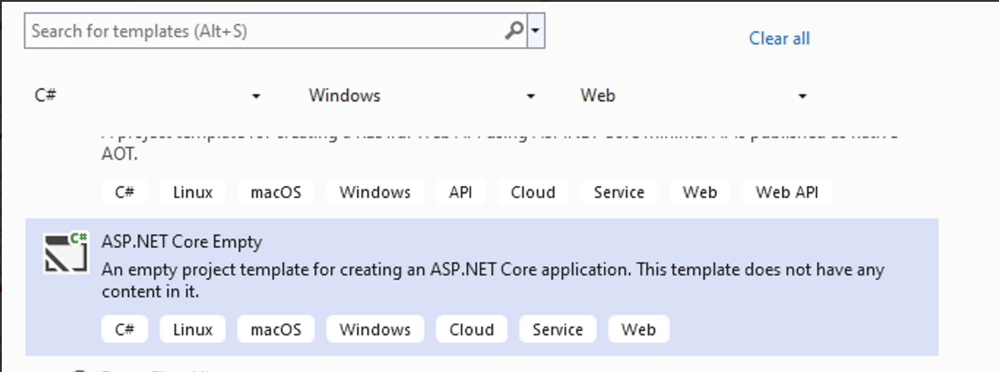
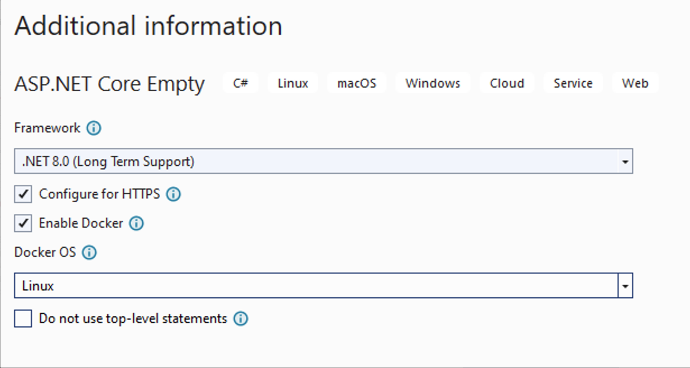
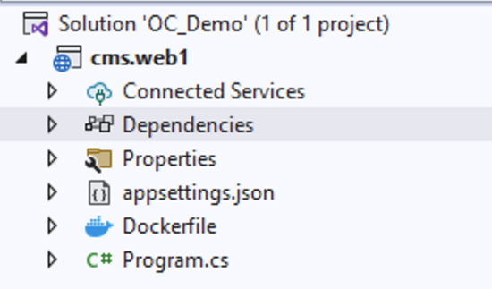

# Intentions

1. Deomostrate how to start up OrchardCore CMS version 1.8.3. Solve the problem if you get block when follow the offical guide. 
2. This is a manual way start with ASP Core empty project in Visual Studio 2022. 
3. Start debug mode in local development enviroment.


# Get Started
Open Visual Studio Create a new project, select 【ASP.NET Core Empty】


### Project Name: cms.web1 

### Next, keep uncheck “Do not use top-level statements”


### After created, the solution folder structure like this 

 

### Nuget search and install `OrchardCore.Application.Cms.Core.Targets`�and�`OrchardCore.Application.Cms.Targets`
.png>)


### Open the program.cs file, overwrite its content with follow 
```
using OrchardCore.Logging;
var builder = WebApplication.CreateBuilder(args);
builder.Host.UseNLogHost();

builder.Services
    .AddOrchardCms()
    .AddSetupFeatures("OrchardCore.AutoSetup");

var app = builder.Build();

if (!app.Environment.IsDevelopment())
{
    app.UseExceptionHandler("/Error");
}

app.UseStaticFiles();
app.UseOrchardCore();
app.Run();
```


## Error
.png>)

```bash
Severity	Code	Description	Project	File	Line	Suppression State
Error	CS0234	The type or namespace name 'Logging' does not exist in the namespace 'OrchardCore' (are you missing an assembly reference?)	cms.web1	C:\xxx\cms.web1\Program.cs	1	Active

Severity	Code	Description	Project	File	Line	Suppression State
Error	CS1061	'ConfigureHostBuilder' does not contain a definition for 'UseNLogHost' and no accessible extension method 'UseNLogHost' accepting a first argument of type 'ConfigureHostBuilder' could be found (are you missing a using directive or an assembly reference?)	cms.web1	C:\xxx\cms.web1\Program.cs	5	Active

```

### To fix above issue, Nuget install `OrchardCore.Logging.NLog`  
 

### Add NLog.config to Project Root 
.png>)

```bash 
<?xml version="1.0" encoding="utf-8" ?>
<nlog xmlns="http://www.nlog-project.org/schemas/NLog.xsd"
      xmlns:xsi="http://www.w3.org/2001/XMLSchema-instance"
      autoReload="true"
      internalLogLevel="Warn"
      internalLogFile="App_Data/logs/internal-nlog.txt">

    <extensions>
        <add assembly="NLog.Web.AspNetCore"/>
        <add assembly="OrchardCore.Logging.NLog"/>
    </extensions>

    <targets>
        <!-- file target -->
        <target xsi:type="File" name="file"
                fileName="${var:configDir}/App_Data/logs/orchard-log-${shortdate}.log"
                layout="${longdate}|${orchard-tenant-name}|${aspnet-traceidentifier}|${event-properties:item=EventId}|${logger}|${uppercase:${level}}|${message} ${exception:format=ToString,StackTrace}"
        />

        <!-- console target -->
        <target xsi:type="Console" name="console" />

    </targets>

    <rules>
        <!-- all warnings and above go to the file target -->
        <logger name="*" minlevel="Warn" writeTo="file" />

        <!-- the hosting lifetime events go to the console and file targets -->
        <logger name="Microsoft.Hosting.Lifetime" minlevel="Info" writeTo="file, console" />
    </rules>
</nlog>
```

### Start debug mode by Visual Studio, choose “IIS Express” then toggle play button.
.png>)

If show up this Setup screen, the Orchardcore CMS is lanuch successfully. 

(Alternatively) start debug mode with **Docker**, your system is required Docker-desktop installed.


# Setup a blog called web1
This demo chooses Recipe as "Blog" and database as Sqlite. 
.png>) 


## set up done.
.png>)


# Admin site

Visit https://localhost:44365/admin  (Your port may not same, follow the visual studio one)