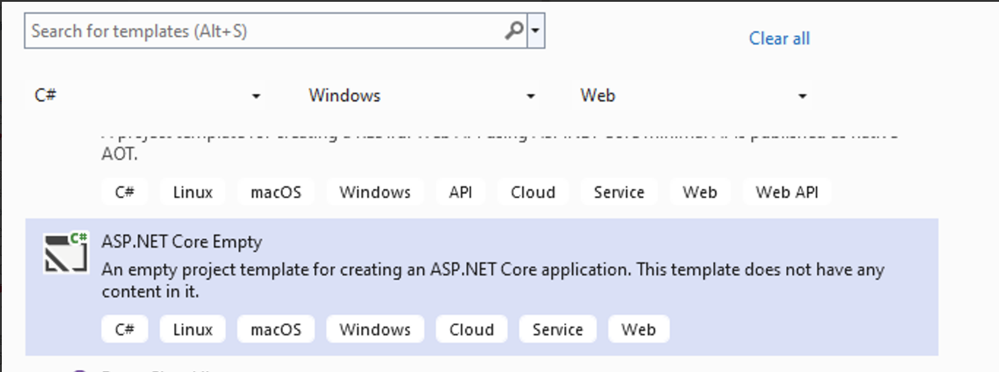
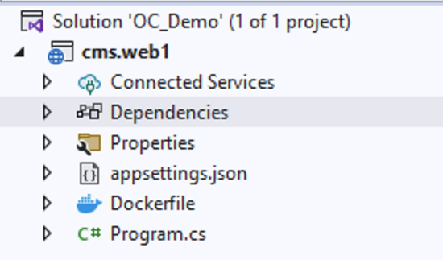

[English](README.md) | [簡体中文](README_CN.md)

##  目標

1. 演示如何启动 OrchardCore CMS 1.8.3 版本。解决按照官方指南操作时遇到的问题。
2. 本文采用在 Visual Studio 2022 中使用 ASP.NET Core 空项目手动启动的方式。
3. 在本地开发环境中启动调试模式。


##  入门

在 Visual Studio 中创建一个新项目，选择“ASP.NET Core 空项目”。


### 项目名称: cms.web1 

### 接下来，取消勾选“不使用顶级语句”。


### 创建完成后，解决方案文件夹结构如下：



### 使用 Nuget 搜索并安装 `OrchardCore.Application.Cms.Core.Targets` 和 `OrchardCore.Application.Cms.Targets`。
.png>)


### 打开 `program.cs` 文件，用以下内容覆盖其内容：
```
using OrchardCore.Logging;
var builder = WebApplication.CreateBuilder(args);
builder.Host.UseNLogHost();

builder.Services
    .AddOrchardCms()
    .AddSetupFeatures("OrchardCore.AutoSetup");

var app = builder.Build();

if (!app.Environment.IsDevelopment())
{
    app.UseExceptionHandler("/Error");
}

app.UseStaticFiles();
app.UseOrchardCore();
app.Run();
```


##  错误

.png>)

```bash
Severity	Code	Description	Project	File	Line	Suppression State
Error	CS0234	The type or namespace name 'Logging' does not exist in the namespace 'OrchardCore' (are you missing an assembly reference?)	cms.web1	C:\xxx\cms.web1\Program.cs	1	Active

Severity	Code	Description	Project	File	Line	Suppression State
Error	CS1061	'ConfigureHostBuilder' does not contain a definition for 'UseNLogHost' and no accessible extension method 'UseNLogHost' accepting a first argument of type 'ConfigureHostBuilder' could be found (are you missing a using directive or an assembly reference?)	cms.web1	C:\xxx\cms.web1\Program.cs	5	Active

```

### 为解决上述问题，使用 Nuget 安装 `OrchardCore.Logging.NLog`。


### 将 `NLog.config` 添加到项目根目录
.png>)

```bash 
<?xml version="1.0" encoding="utf-8" ?>
<nlog xmlns="http://www.nlog-project.org/schemas/NLog.xsd"
      xmlns:xsi="http://www.w3.org/2001/XMLSchema-instance"
      autoReload="true"
      internalLogLevel="Warn"
      internalLogFile="App_Data/logs/internal-nlog.txt">

    <extensions>
        <add assembly="NLog.Web.AspNetCore"/>
        <add assembly="OrchardCore.Logging.NLog"/>
    </extensions>

    <targets>
        <!-- file target -->
        <target xsi:type="File" name="file"
                fileName="${var:configDir}/App_Data/logs/orchard-log-${shortdate}.log"
                layout="${longdate}|${orchard-tenant-name}|${aspnet-traceidentifier}|${event-properties:item=EventId}|${logger}|${uppercase:${level}}|${message} ${exception:format=ToString,StackTrace}"
        />

        <!-- console target -->
        <target xsi:type="Console" name="console" />

    </targets>

    <rules>
        <!-- all warnings and above go to the file target -->
        <logger name="*" minlevel="Warn" writeTo="file" />

        <!-- the hosting lifetime events go to the console and file targets -->
        <logger name="Microsoft.Hosting.Lifetime" minlevel="Info" writeTo="file, console" />
    </rules>
</nlog>
```

### 使用 Visual Studio 启动调试模式，选择“IIS Express”，然后切换播放按钮。
.png>)

如果出现此设置屏幕，则 Orchardcore CMS 启动成功。

（或者）使用 **Docker** 启动调试模式，您的系统需要安装 Docker-desktop。


##  设置名为 web1 的博客

此演示选择“博客”作为配方，选择 Sqlite 作为数据库。
.png>) 


##  设置完成。
.png>)


##  通过管理站点编辑博客和网站内容

访问 https://localhost:44365/admin （您的端口可能不同，请参考 Visual Studio 中的端口）


##  本仓库旨在演示如何启动 Orchardcore CMS。

##  参考资料

[Orchardcore 官方入门指南](https://docs.orchardcore.net/en/latest/getting-started/templates/)
